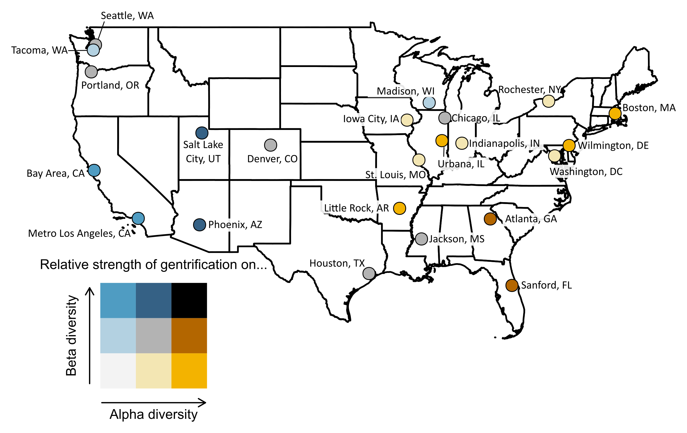

```{r setup, include=FALSE}
knitr::opts_chunk$set(echo = TRUE)
library(dplyr)
library(bbplot)
library(viridis)
library(raster)
library(data.table)
library(sf)
library(knitr)
library(kableExtra)
source("../R/census_functions.R")
source("../R/alpha_beta_functions.R")
sf::sf_use_s2(FALSE)
```
\def\figurename{Figure S}
\def\tablename{Table S}
\captionsetup{labelfont={bf}}

\vspace{-1truemm}

\begin{flushleft}
\Large Gentrification drives patterns of alpha and beta diversity in cities \hfill

\large Mason Fidino, Heather A. Sander, Jesse S. Lewis, Elizabeth W. Lehrer, Kimberly Rivera, Maureen H. Murray, Henry C. Adams, Anna Kase, Andrea Flores, Theodore Stankowich, Christopher J. Schell, Carmen M. Salsbury, Adam T. Rohnke, Mark J. Jordan, Austin M. Green, Ashley R. Gramza, Amanda J. Zellmer,, Jacque Williamson, Thilina D. Surasinghe, Hunter Storm, Kimberly L. Sparks, Travis J. Ryan, Katie R. Remine, Mary E. Pendergast, Kayleigh Mullen, Darren E. Minier, Christopher R. Middaugh, Amy L. Mertl, Maureen R. McClung, Robert A. Long, Rachel N. Larson, Michel T. Kohl, Lavendar R. Harris, Courtney T. Hall, Jeffrey D. Haight, David Drake, Alyssa M. Davidge, Ann O. Cheek, Christopher P. Bloch, Elizabeth G. Biro, Whitney J. B. Anthonysamy, Julia L. Angstmann, Maximilian L. Allen, Solny A. Adalsteinsson, Anne G. Short Gianotti, Jalene M. LaMontagne, Tiziana A. Gelmi-Candusso, Seth B. Magle
\hfill
\newline
\newline
Mason Fidino \newline
Email: mfidino@lpzoo.org

\end{flushleft}


## The PDF file includes:
\begin{itemize}
  \vspace{-0.2cm}\item[] Detailed description of statistical models
  \vspace{-0.2cm}\item[] Species detected and camera trap data summary (Tables S1 - S2)
  \vspace{-0.2cm}\item[] Additional Gentrification Metric Details (Tables S3 - S10)
  \vspace{-0.2cm}\item[] Map of Cities (Fig. S1)
  \vspace{-0.2cm}\item[] City-specific Alpha and Beta Diversity Results (Fig. S2 - S24)
  \vspace{-0.2cm}\item[] Alpha Diversity Model Estimates (Tables S11 - S13)
  \vspace{-0.2cm}\item[] Beta Diversity Model Estimates (Tables S14 - S16)
  \vspace{-0.2cm}\item[] Multi-city Multi-species Occupancy Model Estimates (Tables S17 - S36)
    \vspace{-0.2cm}\item[] SI References  (\textit{1-10})
\end{itemize}


\newpage

## Detailed description of statistical models

### *The multi-city multi-species autologistic occupancy model*


This model is almost exactly the same model as we had used in Magle et al. (*1*). For $s$ in $1,...,S$ species and $c$ in $1,...,C$ cities, $\pi_{sc}$ is the probability species $s$ is within city $c$. Further, let $x_{sc}$ be a Bernoulli random variable that equals 1 if the species is within that city and is otherwise zero such that $x_{sc} \sim \text{Bernoulli}(\pi_{sc})$. We made $\pi_{sc}$ a function of one covariate--the distance a city is from the known edge of a species extent--using the logit link. This covariate was positive if a city was within a species extent and negative if it was outside. We compiled range information from IUCN red list data (*2*). Thus the linear predictor for this level of the model was

$$
\text{logit}(\pi_{sc}) = \pmb{d}_s\pmb{h}_c
$$
where $\pmb{d}_s$ is a vector of species-specific covariates while $\pmb{h}_c$ is a vector of conformable regression coefficients where the leading element is 1 to accomodate the model intercept.

As the first level of the model estimates a species presence at the city-level, the next level estimates species presence within cities conditional on their presence in a city. Given that the number of sites and sampling periods varies across cities, we add a city subscript to define $i_c$ in $1,...,I_c$ sites  and $t_c$ in $1,...,T_c$ sampling periods. However, for simplicity we drop these specific subscripts while we explain the model. Additionally, let $z_{scit}$ be a Bernoulli random variable and $\psi_{scit}$ be the probability of occupancy. As such, $z_{scit} \sim \text{Bernoulli}(\psi_{scit}x_{sc})$. As with the previous level of the model, $\psi_{scit}$ can be made a function of covariates via the logit link. As a depature from the Magle et al. (*1*) parameterization, we added a first-order autologistic term to account for any temporal dependence in occupancy status between adjacent sampling periods within a city. Thus, for the first time period in a city, the logit-linear predictor was

$$
\text{logit}(\psi_{scit=1}) = \pmb{\beta}_{sc}\pmb{f}_{ci}
$$
where $\pmb{\beta}_{sc}$ is a vector of species and city-specific parameters and $\pmb{f}_{ci}$ is a vector of conformable covariates whose first value is 1 for the model intercept. After the first sampling season, we added our autologistic term

$$
\text{logit}(\psi_{scit}) = \pmb{\beta}_{sc}\pmb{f}_{ci} + \theta_{sc}z_{scit-1} \text{, for t > 1.}
$$

For the data model, $y_{scit}$ was the number of days species $s$ was detected at city $c$ and site $i$ on sampling season $t$. Given $j_{cit}$ days of sampling, we assumed $y_{scit}$ is a binomial random variable conditional on species presence

$$
y_{scit} | z_{scit} \sim \text{Binomial}(j_{cit},\rho_{scit}z_{scit} )
$$

where $\rho_{scit}$ is the daily probability of detection that can be made a function of covariates with the logit link, 

$$
\text{logit}(\rho_{scit}) = \pmb{\alpha}_{sc}\pmb{g}_{ci}
$$
where $\pmb{\alpha}_{sc}$ is a vector of parameters and $\pmb{g}_{ci}$ is a vector of conformable covariates where the leading value is 1 to accommodate the intercept.

Given that some species occur across multiple cities, there are multiple levels in which species could partially share information. At the top-level of the model we have the simplest hierarchical parameterization for parameters associated to $\pi_{sc}$, namely that there is a community mean for each parameter of which species-level coefficients vary around. We show this for the model intercept with the understanding that the same parameterization applies to all logit-scale covariates in this part of the model.


\begin{equation}
\begin{aligned}
\bar{d}_{0s}   &\sim \text{Cauchy}(0, 2.5)\nonumber \\
\sigma_{d_0} &\sim \text{Inv-Gamma}(1,1)\nonumber \\
d_{0s}   &\sim \text{Normal}(\bar{d}_{0s}, \sigma_{d_0})\nonumber
\end{aligned}
\end{equation}

For the rest of the latent state model we add an additional hierarchical level to the model. However, this parameterization also aligns with the data model, and as such so we only describe it here once for the model intercept of the latent-state model. For example, for the model intercepts we begin with a community-level average among species and cities ($\bar{\beta}_0$). This parameter partially informs a species-level average among cities ($\bar{\beta}_{0s}$), which then informs species-specific coefficients in all cities ($\beta_{0sc}$). 

\begin{equation}
\begin{aligned}
\bar{\beta}_0   &\sim \text{Cauchy}(0, 2.5)\nonumber \\
\sigma_{\beta_0} &\sim \text{Inv-Gamma}(1,1)\nonumber \\
\bar{\beta}_{0s} &\sim \text{Normal}(\bar{\beta}_0, \sigma_{\beta_0}) \\
a_{\beta_0} &\sim \text{Uniform}(0,10) \\
b_{\beta_0} &\sim \text{Uniform}(0,10) \\
\sigma_{\beta_{0s}} &\sim \text{Inv-Gamma}(a_{\beta_0}, b_{\beta_0}) \\
\beta_{0sc} &\sim \text{Normal}(\bar{\beta}_{0s},\sigma_{\beta_{0s}} )
\end{aligned}
\end{equation}

We added the hyperparameters for the shape ($a_{\beta_0}$) and rate ($b_{\beta_0}$) of the Inv-Gamma distribution to account for the fact that some cities may only have one sampling period of data. Note that the above parameterization also applies to the autologistic term of the model ($\theta_{sc}$).

Finally, the latent state and data model included one other set of parameters to account for variation in occupancy or detectability across sampling seasons. As we have already added hierarchical structure via the centered parameterization of the other model parameters, we usd a non-centered parameterization here for this level of variability. Again, we show this for the latent state, but with a swapping of subscripts this could readily be applied to the data model as well.

\begin{equation}
\begin{aligned}
a_{\psi} &\sim \text{Uniform}(0,10)\nonumber  \\
b_{\psi} &\sim \text{Uniform}(0,10)\nonumber  \\
\sigma_{\psi c} &\sim \text{Inv-Gamma}(a_{\psi}, b_{\psi}) \\
\beta_{sct} &\sim \text{Normal}(0, \sigma_{\psi c})
\end{aligned}
\end{equation}

With this parameterization, $\beta_{sct}$ is a difference term that represents the logit-scale difference in occupancy for species $s$ at city $c$ from their average $\beta_{0sc}$ (i.e., the model intercept). Again, like with the other parameters in this part of the model, we used hyperparameters for the Inv-Gamma distribution because not every city had more than one season of data.

### *The alpha diversity meta-analytic model*

From our occupancy model we created a posterior distribution for the latent state of each species at each site across all cities ($z_{scit}$). From this, we derived two quantities for this model:

1. The mean expected species richness at each site across all sampling periods ($r_{ci}$). To do so, we calculated the number of unique species detected in city $c$ and site $i$ across the $t$ sampling seasons and took the median across 5000 posterior samples.
2. The standard deviation of the first quantity across those 5000 posterior samples ($\sigma_{ci}$). This quantifies our level of uncertainty with the first estimate.

Following this, let $\pmb{\beta}_c$ be a vector of city-specific regression coefficients and $\pmb{x}_{ci}$ be a vector of city and site specific covariates where the leading element is 1 to account for the intercept. Within the linear predictor we also added an additional residual variation term, $\epsilon_{ci}$, which was given a $\sim \text{Inv-Gamma}(1,1)$ prior. Thus, the log-linear predictor was

$$
\text{log}(\mu_{sci}) = \pmb{\beta}_c\pmb{x_{ci}} + \epsilon_{ci}
$$
and following Kéry and Royle (*3*), we accounted for variability in the response variable with an additional level of the model

$$
r_{ci} \sim \text{Normal}(\mu_{sci}, \sigma_{ci})
$$
We treated the intercept and slope terms as city-level random effects. For example, the prior for the model intercept was

\begin{equation}
\begin{aligned}
\bar{\beta}_0 & \sim \text{Cauchy}(0, 2.5)\nonumber \\
\sigma_{\beta_0} & \sim \text{Inv-Gamma}(1,1) \\
\beta_{0c} & \sim \text{Normal}(\bar{\beta}_0,\sigma_{\beta_0}) \\
\end{aligned}
\end{equation}

and the same specification was also applied to the slope terms as well (though not described here).

### *The beta diversity meta-analytic model*

From our occupancy model, we created a posterior distribution for the latent state of each species at each site across all cities ($z_{scit}$). From this, we derived three quantities:

1. The mean pairwise Sørensen dissimilarity between pairs of sites within each city across all sampling periods ($v_{cik}$, where the subscript k denotes one of the sites in city $c$ that is not the $ith$ site). To do so, we calculated the number of unique species detected in city $c$ and site $i$ across the $t$ sampling seasons. Following this, we calculated the Sørensen dissimilarity metric among all pairs of sites within each city using `vegan` in `R` across 5000 posterior samples (*4, 5*). Finally,  we took the median across all posterior samples for each site-pair
2. The standard deviation of the first quantity across those 5000 posterior samples ($\sigma_{cik}$). This quantifies our level of uncertainty with the first estimate.
3. The mean expected number of unique species between a site-pair ($w_{cik}$). 

To estimate pairwise dissimilarity as a function of covariates we modified a generalized dissimilarity model (GDM) to account for parametetric uncertainity of the response variable $v_{cik}$ (*6, 7*). To do so, GDMs estimate the relationship between dissimilarity and environmental or spatial differences between pairs of sites with a clog link (*7*):

$$
d_{cik} = 1 - \text{exp}(-\eta_{cik})
$$
where $d_{cik}$ is the biological dissimilarity between sites $i$ and $k$ within city $c$ and $\eta_{cik}$ is the predicted ecological distance between (i.e., the linear predictor). Given $p$ in 1,..,$P$ covariates, the ecological distance between sites is

$$
\eta_{cik} = b_0 + \sum_{p=1}^{P}|f_p(x_{cip}) - f_p(x_{ckp})|
$$
where $b_0$ is the model intercept (i.e., the expected pairwise dissimilarity between sites with identical environments). Covariates are further transformed within GDMs which 1) uses I-spline basis functions (*8*) and 2) constrains slope terms to be non-negative. Doing so allows the effect of each covariate to non-linearly vary while also ensuring that beta diversity increases monotonically as sites are more different from one another (a core assumption of this model). More specifically, the I-spline basis function for predictor $p$ with 3 basis functions (the default used for GDMs) is

$$
f_p(x_{cip}) = \sum_{j = 1}^3a_{cpj}I_{pj}(x_{cip})
$$
where $a_{cpj}$ is a non-negative coefficient for the $jth$ I-spline and $I_{pj}$ is the $jth$ I-spline of the covariate $x_{cip}$. For our own model, the binary gentrification status of site-pairs was not sent through an I-spline basis function. Instead, we used a dummy variable that took the value of 1 if a pair of sites differed in their gentrification status and was otherwise 0. Regardless, all slope terms were constrained to be non-negative. Thus, given $\eta_{cik}$ and the total number of species between site pairs ($w_{cik}$), the first level of our model is

\begin{equation}
\begin{aligned}
d_{cik} &= 1 - \text{exp}(-\eta_{cik})\nonumber \\
\sigma_{cik} &= \sqrt{\frac{d_{cik} - (1 - d_{cik})}{w_{cik}}} \\
\mu_{cik} &\sim \text{Half-Normal}(d_{cik}, \sigma_{cik})
\end{aligned}
\end{equation}

where $\sigma_{cik}$ is the binomial variance function (*6*) and the half-Normal is constrained to be non-negative. Following this, we account for variation in the measurement of our response variable

$$
v_{cik} \sim \text{Half-Normal}(\mu_{cik}, \sigma_{cik})
$$
where again $\sigma_{cik}$ is measured based on the output of the occupancy model and provided as data to this model.

We treated all coefficients in the linear predictor as city-level random effects. For example for the model intercept the prior specification would be  $b_c \sim \text{Half-Normal}(\bar{b}, \sigma_b)$ where $b \sim \text{Half-Normal}(0, 10)$ and $sigma_b \sim \text{Inv-Gamma}(1,1)$. The Half-Normal distributions ensure that the coefficients will be non-negative.

\newpage

## Species detected and camera trap data summary


```{r species_in_city, echo = FALSE}

sp <- read.csv("../data/species_in_analysis.csv")


sp_df <- data.frame(
  cn = gsub("_", " ", sp$species),
  sn = c(
    "Dasypus novemcinctus",
    "Lynx rufus",
    "Sylvilagus audubonii, S. floridanus, S. bachmani, S. palustris",
    "Canis latrans",
    "Tamias striatus",
    "Cervus canadensis",
    "Glaucomys volans, G. sabrinus",
    "Sciurus niger",
    "Urocyon cinereoargenteus",
    "Sciurus carolinensis, S. griseus",
    "Odocoileus hemionus",
    "Taxidea taxus",
    "Castor canadensis",
    "Neovison vison",
    "Procyon lotor",
    "Vulpes vulpes",
    "Mephitis mephitis",
    "Tamiasciurus hudsonicus",
    "Didelphis virginiana",
    "Odocoileus virginianus",
    "Marmota monax")
)
colnames(sp_df) <- c("Common name", "Scientific name")

sp_df %>% 
  kableExtra::kbl(
    format = "latex",
    align = c("l","l", "r","r"),
    caption = "Species used in our analysis.",
    longtable = TRUE,
    booktabs = TRUE, linesep = ""
  ) %>% 
  kableExtra::kable_styling(latex_options="repeat_header")
```

\newpage
```{r table s1, echo = FALSE, message = FALSE, warning = FALSE}
dat <- data.table::fread(
  "../data/detection_data.csv",
  data.table = FALSE
)
dat <- dat[dat$Y>0,]
dat <- dat %>% 
  dplyr::group_by(City, Species) %>% 
  dplyr::summarise(
    nsite = length(unique(Site)),
    ndets = sum(Y)
  ) %>% 
  data.frame()
unq_places <- unique(dat$City)

pretty_names <- c(
  "Athens, GA",
  "Bay Area, CA",
  "Boston, MA",
  "Chicago, IL",
  "Denver, CO",
  "Houston, TX",
  "Indianapolis, IN",
  "Iowa City, IA",
  "Jackson, MS",
  "Little Rock, AR",
  "Madison, WI",
  "Metro LA, CA",
  "Washington D.C. metro area",
  "Phoenix, AZ",
  "Portland, Oregon",
  "Rochester, NY",
  "Sanford, FL",
  "Salt Lake City, UT",
  "Seattle, WA",
  "Saint Louis, MO",
  "Tacoma, WA",
  "Urbana, IL",
  "Wilmington, DE"
)
for(i in 1:length(unq_places)){
  dat$City[dat$City == unq_places[i]] <- pretty_names[i]
}

dat$Species <- gsub("_", " ", dat$Species)
dat <- dat[order(dat$City, dat$ndets),]

colnames(dat) <- c("City", "Species", "Sites detected", "Days detected")


dat %>% 
  kableExtra::kbl(
    format = "latex",
    align = c("l","l", "r","r"),
    caption = "The number of sites species were detected and number of detections per city. This table included all species, not only those we could use in our analysis. Table is ordered by city, and within each city species are sorted from fewest to most detections.",
    longtable = TRUE,
    booktabs = TRUE, linesep = ""
  ) %>% 
  kableExtra::kable_styling(latex_options="repeat_header")

```
\newpage

## Additional gentrification metrics

As previously stated we used a slightly modified version of the gentrification metric proposed by Chapple et al. (*9*). This metric used a two-step process to identify gentrification. First, for an area to be gentrifying, it must be vulnerable to gentrification at the start of the study (in this case that is 2010). For our version of this metric a Census tract to be vulnerable to gentrification it must:

1. Have had at least 500 residents in year 2010.
2. Have had at least two of these three qualities 
  a. The median income of residents in the Census tract must be lower than the city's average income.
  b. The proportion of college-educated residents in the census-tract must be lower than the proportion of college-educated residents across the city.
  c. The proportion of nonwhite residents in the Census tract must be greater than the proportion of nonwhite residents across the city.
  

After calculating Census tract vulnerability, we created a 500m radius buffer around each camera trapping location within a city and intersected that buffer with the Census tract level vulnerability index. This buffer was chosen to capture the general area around each site that easily fell within the home range of any species in our analysis. For example, a site could be right on the edge of a non-vulnerable Census tract that abuts a vulnerable Census tract and we would want to identify that location as 'vulnerable.'

Of 999 UWIN sites across 20 cities, 474 (47.4%) were considered vulnerable to gentrification.

Following this, a Census tract was considered gentrifying if at the end of the study (in this case that is 2019) a Census tract:

1. Was vulnerable to gentrification in 2010.
2. The change in median income was greater than the average change across the city, after correcting for inflation.
3. Had at least one of these two qualities.
  a. The change in the proportion of college educated residents was greater than average change across the city.
  b. The change in the proportion of non-hispanic white residents was greater than the average change across the city.
  

Of the 474 sites that were vulnerable to gentrification, about half of them of them were gentrifying (n = 264, 55.7%). However,there is a substantial amount of variation among cities. For example, Urbana, IL only had one of thirty five sites near a gentrifying Census tract while Phoenix, AZ had exactly half of their 96 sites in gentrifying areas.

### *Retrieving the census data*

We used the `tidycensus` package in `R` to query census data from the year 2010 and 2019 (*10*). The 2010 data came from the 10-year decennial census whereas the 2019 data came from the 5-year American Community Survey.

Across these years we compiled data the aforementioned variables for all Census tracts that were within the general area of a UWIN transect. To do so we created a bounding box around the camera trap locations for each city, added a 500m buffer, and then cropped the census data.

### *Step 1. Determine which areas are vulnerable to gentrification*

After cropping the Census tracts to an area around a cities sampled location, we calculated the regional median (i.e., median income across Census tracts) and identified Census tracts that fell below that number in 2010.


```{r med_inc, echo = FALSE, include = FALSE, message = FALSE, warning = FALSE}

# the buffer around which you want to explore whether a site
#  is nearby a gentrifying area.
my_buffer <- 500

coords <- read.csv(
    "../data/gentri_all_coordinates.csv"
)

# gentrification metrics data.frame

# now convert coords to spatial object
coords <- sf::st_as_sf(
  coords,
  coords = c("Long", "Lat"),
  crs = 4326
)

coords$City <- gsub("phaz2", "phaz", coords$City)

med <- readRDS("../data/census_data/med_income/med_income_2010.RDS")


med <- lapply(
  med,
  function(x){
    sf::st_transform(
      x,
      crs = 4326
    )
  }
)


city_result <- vector("list", length = length(med))

gvals <- rep(NA, length(med))

# # add the city to each Census tract
unq_city <- unique(coords$City)
city_dict <- vector(
  "list",
  length = length(med)
)

# map each element of the list to a given city
for(i in 1:length(med)){
  cat(paste("\n",i,"\n"))
  pb <- txtProgressBar(max = length(unq_city))
  for(j in 1:length(unq_city)){
    setTxtProgressBar(pb, j)
    found_cities <- unlist(city_dict)
    if(unq_city[j] %in% found_cities & unq_city[j] != "naca"){
      next
    }

  tmp <- suppressMessages(
      sf::st_intersection(
      med[[i]],
      coords[coords$City == unq_city[j],]
    )
  )
  if(nrow(tmp)> 0){
    if(length(city_dict[[i]]) > 0){
    city_dict[[i]] <- c(city_dict[[i]], unq_city[j])
    } else {
      city_dict[[i]] <- unq_city[j]
    }
  }
  }
}

# The national capital is three places combined, so we may
#  as well combine them and remap.
has_naca <- which(
  sapply(city_dict, function(x) any(x == "naca"))
)
naca_stuff <- bind_rows(med[c(has_naca)])
med <- med[-has_naca]
med <- append(
  med,
  list(naca_stuff)
)


# remap
city_dict <- vector(
  "list",
  length = length(med)
)

# map each element of the list to a given city
for(i in 1:length(med)){
  cat(paste("\n",i,"\n"))
  pb <- txtProgressBar(max = length(unq_city))
  for(j in 1:length(unq_city)){
    setTxtProgressBar(pb, j)
    found_cities <- unlist(city_dict)
    if(unq_city[j] %in% found_cities & unq_city[j] != "naca"){
      next
    }
  tmp <-suppressMessages(
    sf::st_intersection(
      med[[i]],
      coords[coords$City == unq_city[j],]
    )
  )
  if(nrow(tmp)> 0){
    if(length(city_dict[[i]]) > 0){
    city_dict[[i]] <- c(city_dict[[i]], unq_city[j])
    } else {
      city_dict[[i]] <- unq_city[j]
    }
  }
  }
}

# also there was one element in the list with no overlapping
#  sites, remove it
to_go <- which(
  sapply(city_dict, is.null)
)

city_dict <- city_dict[-to_go]
med <- med[-to_go]
city_data <- vector(
  "list",
  length = length(unq_city)
)
names(city_data) <- unq_city
for(i in 1:length(med)){
  
  # get utms
  my_utms <- longlat_to_utm(
    c(
      mean(st_bbox(med[[i]])[c("xmin","xmax")]),
      mean(st_bbox(med[[i]])[c("ymin","ymax")])
    )
  )

  tmp <- coords[
    coords$City %in% city_dict[[i]] ,
  ]
  tmp <- sf::st_transform(
    tmp,
    crs = my_utms
  )
  tmp <- split(
    tmp,
    factor(tmp$City)
  )
  for(j in 1:length(tmp)){
  
  my_bbox <- st_bbox(
    tmp[[j]]
  ) + c(-500, -500, 500, 500) 
  
  area_cropped <- sf::st_crop(
    sf::st_transform(
      med[[i]],
      crs = my_utms
    ),
    my_bbox
  )
  area_cropped$City <- names(tmp)[j]
  my_city <- which(
    names(city_data) == names(tmp)[j]
  )
  city_data[names(tmp)[j]] <- list(
    sf::st_transform(
      area_cropped,
      4326
    )
  )
  }
}
# combine, and then split by city
allmed <- dplyr::bind_rows(city_data)

citymed <- split(
  allmed,
  factor(allmed$City)
)

# go through each city now and compile the income metric
income_result <- vector("list", length = length(citymed))
for(i in 1:length(citymed)){
  gvals[i] <- quantile(
    citymed[[i]]$estimate,
    probs = c(0.5),
    na.rm = TRUE
  )
  # figure out which tracts are less than the 50th quantile
  citymed[[i]]$income <- citymed[[i]]$estimate < gvals[i]
  
  # and then figure out which sites are
  income_result[[i]] <- sf::st_intersection(
    coords,
    citymed[[i]]
  )
}

# combine all city_results
income_result <- dplyr::bind_rows(income_result)

```
\newpage
```{r income_table, echo = FALSE}

# NA to FALSE
income_result$income[is.na(income_result$income)] <- FALSE
aa <- table(income_result$City, income_result$income)
aa <- data.frame(
  City = pretty_names,
  False = aa[,1],
  True = aa[,2]
)

row.names(aa) <- NULL
aa %>% 
  kableExtra::kbl(
    format = "latex",
    align = c("l", "r","r"),
    caption = "The number of sites that were above (False) and below (True) the median income across Census tracts in 2010. This was used to help determine if sites were vulnerable to gentrification.",
    longtable = TRUE,
    booktabs = TRUE, linesep = ""
  ) %>% 
  kableExtra::kable_styling(latex_options="repeat_header")

```
\newpage

Following this, we calculated the median educational attainment in 2010 across Census tracts, which was calculated similarly to income. We simplified the census data into two categories for educational attainment: those with a college degree and those without a college degree.

```{r education_vuln, echo = FALSE, include = FALSE, message = FALSE, warning = FALSE}
if(!file.exists("../data/census_data/education/gent_vulnerability.rds")){
h1 <- readRDS("../data/census_data/education/education_2010.RDS")
h1 <- lapply(
  h1,
  dplyr::ungroup
)
h1 <- dplyr::bind_rows(h1)

# project to 4326
h1 <- sf::st_transform(
  h1,
  4326
)

h2 <- readRDS("../data/census_data/education/education_2019.RDS")
h2 <- lapply(
  h2,
  dplyr::ungroup
)
h2 <- dplyr::bind_rows(h2)

h2 <- st_transform(
  h2,
  4326
)

#  we can use that over again.
edumed <- vector("list", length = length(citymed))

# store the suggested GEOIDs using the explanation above.

# This takes a while to run so I don't want to do it unless it's needed.
#  thus I saved it as an RDS file.

  for(i in 1:length(edumed)){
   # reproject h1 to
   mmed <- st_transform(
     citymed[[i]],
     4326
   )
  
   # get what intersects with a given city in 2000
  tmp1 <- suppressMessages(
      sf::st_crop(
      h1,
      mmed
    )
  )
  
  
  # store these values in a list
  edumed[[i]] <- tmp1
  # get lat/long to convert to utm, needed for rasterizing.

  
  # we need to reduce this to people with and without 
  #  a college degree
  edumed[[i]]$variable <- gsub(
    "advanced college degree|college graduate",
    "college degree",
    edumed[[i]]$variable
  )

  edumed[[i]]$variable <- gsub(
    "hs diploma|no hs diploma|some college",
    "no college degree",
    edumed[[i]]$variable
  )
  # now group and sum a bit, and then calcualte proportion
  #  with a college degree
  edumed[[i]] <- edumed[[i]] %>% 
    dplyr::group_by(GEOID, variable) %>% 
    dplyr::summarise(
      total = unique(summary_est),
      value = sum(value, na.rm = TRUE),
      .groups = "drop_last"
    ) %>% 
    dplyr::ungroup()
  
  edumed[[i]]$prop <- edumed[[i]]$value / edumed[[i]]$total
  edumed[[i]] <- edumed[[i]][edumed[[i]]$variable == 'college degree',]
  
  edumed[[i]]$edu_under <- edumed[[i]]$prop < 
    median(edumed[[i]]$prop, na.rm = TRUE)

}

saveRDS(
  edumed,
  "../data/census_data/education/gent_vulnerability.rds"
)
edu_list_vuln <- edumed
}else{
  edu_list_vuln <- readRDS("../data/census_data/education/gent_vulnerability.rds")
}


# and then figure out which sites fall in these areas

# and then we need to figure out which of our sites fall within these areas
edu_result <- vector("list", length = length(edu_list_vuln))
for(i in 1:length(edu_result)){
  tmp <- edu_list_vuln[[i]]
  tmp <- sf::st_transform(
    tmp,
    sf::st_crs(coords)
  )
  edu_result[[i]] <- sf::st_intersection(
    coords,
    tmp
  )
}

edu_result <- dplyr::bind_rows(edu_result)

```

\newpage

```{r edu_vuln_table, echo = FALSE}

edu_result$edu_under[is.na(edu_result$edu_under)] <- FALSE
aa <- table(edu_result$City, edu_result$edu_under)
aa <- data.frame(
  City = pretty_names,
  False = aa[,1],
  True = aa[,2]
)

row.names(aa) <- NULL
aa %>% 
  kableExtra::kbl(
    format = "latex",
    align = c("l", "r","r"),
    caption = "The number of sites that were above (False) and below (True) the median educational attainment (i.e., college degree) across Census tracts in 2010. This was used to help determine if sites were vulnerable to gentrification.",
    longtable = TRUE,
    booktabs = TRUE, linesep = ""
  ) %>% 
  kableExtra::kable_styling(latex_options="repeat_header")

```

\newpage

We then calculated whether Census tracts had at least 500 people in 2010.
The educational attainment data also had information on the number of people in each Census tract, so we used that to create a binary metric for whether or not a Census tract in 2010 had at least 500 people living in them. Of the 8133 Census tracts across all cities, only 114 of them had fewer than 500 residents.
```{r mt500, echo = FALSE, include = FALSE}

npeople <- edu_list_vuln

for(i in 1:length(npeople)){
  npeople[[i]]$mt500 <- npeople[[i]]$total >= 500
}


```

The final metric we obtained to determine the vulnerability of Census tracts was whether the proportion of non-hispanic white people living there was lower than the regional median.


```{r nwprop, echo = FALSE, include = FALSE, message = FALSE, warning = FALSE}
if(!file.exists("../data/census_data/race/gent_vulnerability.rds")){
nw <- readRDS("../data/census_data/race/race_2010.RDS")


nw <- lapply(
  nw,
  dplyr::ungroup
)
nw <- dplyr::bind_rows(nw)

# project to 4326
nw <- sf::st_transform(
  nw,
  4326
)


#  we can use that over again.
nwmed <- vector("list", length = length(citymed))

# store the suggested GEOIDs using the explanation above.
nw_list <- vector("list", length = length(citymed))
names(nw_list) <- names(citymed)

# This takes a while to run so I don't want to do it unless it's needed.
#  thus I saved it as an RDS file.

  for(i in 1:length(nwmed)){
   # reproject h1 to
   mmed <- st_transform(
     citymed[[i]],
     4326
   )
  
   # get what intersects with a given city in 2000
  tmp1 <- suppressMessages(
      sf::st_crop(
      nw,
      mmed
    )
  )
  # store these values in a list
  nwmed[[i]] <- tmp1
  
  # we need to rnwce this to people with and without 
  #  a college degree
  nwmed[[i]]$variable <- gsub(
    "Black|Asian|Latino",
    "Non-white",
    nwmed[[i]]$variable
  )


  # now group and sum a bit, and then calcualte proportion
  #  with a college degree
  nwmed[[i]] <- nwmed[[i]] %>% 
    dplyr::group_by(GEOID, variable) %>% 
    dplyr::summarise(
      total = unique(summary_value...Total),
      value = sum(value, na.rm = TRUE),
      .groups = "drop_last"
    ) %>% 
    dplyr::ungroup()
  
  nwmed[[i]]$prop <- nwmed[[i]]$value / nwmed[[i]]$total
  nwmed[[i]] <- nwmed[[i]][nwmed[[i]]$variable == 'Non-white',]
  
  nwmed[[i]]$nw_over <- nwmed[[i]]$prop > 
    median(nwmed[[i]]$prop, na.rm = TRUE)

}

saveRDS(
  nwmed,
  "../data/census_data/race/gent_vulnerability.rds"
)
nw_list <- nwmed
}else{
  nw_list <- readRDS("../data/census_data/race/gent_vulnerability.rds")
}

# and then figure out which sites fall in these areas

# and then we need to figure out which of our sites fall within these areas
nw_result <- vector("list", length = length(nw_list))
for(i in 1:length(nw_result)){
  tmp <- nw_list[[i]]
  tmp <- sf::st_transform(
    tmp,
    sf::st_crs(coords)
  )
  nw_result[[i]] <- sf::st_intersection(
    coords,
    tmp
  )
}

nw_result <- dplyr::bind_rows(nw_result)

```

\newpage

```{r nw_vuln_table, echo = FALSE}
nw_result$nw_over[is.na(nw_result$nw_over)] <- FALSE
aa <- table(nw_result$City, nw_result$nw_over)

aa <- data.frame(
  City = pretty_names,
  False = aa[,1],
  True = aa[,2]
)

row.names(aa) <- NULL
aa %>% 
  kableExtra::kbl(
    format = "latex",
    align = c("l", "r","r"),
    caption = "The number of sites near Census tracts that had more (False) or less (True) than the regional median of non-hispanic white residents in 2010. This was used to help determine if sites were vulnerable to gentrification.",
    longtable = TRUE,
    booktabs = TRUE, linesep = ""
  ) %>% 
  kableExtra::kable_styling(latex_options="repeat_header")
```

\newpage

Finally, after combining these metrics we can arrive at the number of sites that were vulnerable to gentrification in 2010.

```{r vuln_combo, echo = FALSE}
# store site-specific info
vuln_list <- vector("list", length = length(citymed))
# store Census tract data too
vuln_list_poly <- vuln_list
if(
  !file.exists(
    "../data/census_data/vuln_census_tracts.rds") |
  !file.exists(
    "../data/census_data/vuln_sites.rds"
  )
){
for(i in 1:length(citymed)){
  gent_result <- citymed[[i]][,c("City", "income")]
  
  gent_result <- sf::st_join(
    gent_result,
    edu_list_vuln[[i]][,"edu_under"],
    largest = TRUE
  )
  gent_result <- sf::st_join(
    gent_result,
    npeople[[i]][,"mt500"],
    largest = TRUE
  )
  gent_result <- sf::st_join(
    gent_result,
    nw_list[[i]][,"nw_over"],
    largest = TRUE
  )
  tmp_coords <- coords[
    coords$City == names(citymed)[i],
  ]
  # convert to UTMs
  gent_result <- sf::st_transform(
    gent_result,
    longlat_to_utm(gent_result)
  )
  gent_result$tmpsi <- 1:nrow(gent_result)
  gent_result <- gent_result %>% 
  dplyr::group_by(tmpsi) %>% 
  dplyr::mutate(
    vulnerable = 
      (
        sum(
          c(income, edu_under, nw_over),
          na.rm = TRUE
        ) > 1
      ) * mt500
  ) %>% 
    dplyr::ungroup()
  gent_result <- gent_result[,
      -which(colnames(gent_result) == "tmpsi")
  ]
  # keep this spatial data, we'll need it later
  vuln_list_poly[[i]] <- sf::st_transform(
    gent_result,
    4326
  )
  
  tmp_coords <- sf::st_transform(
    tmp_coords,
    crs = sf::st_crs(gent_result)
  )
  tmp_buff <- sf::st_buffer(
    tmp_coords,
    my_buffer
  )
  
  g_tmp <- sf::st_intersection(
    gent_result,
    tmp_buff
  ) %>% 
    dplyr::group_by(
      Site
    ) %>% 
    dplyr::summarise(
      vulnerable = sum(vulnerable, na.rm = TRUE)>0
    ) %>% 
    sf::st_intersection(
      .,
      tmp_coords
    ) %>% 
    sf::st_transform(
      .,
      crs = 4326
    )
  
  vuln_list[[i]] <- g_tmp
  
}
  save.RDS(
    vuln_list,
    "./data/census_data/vuln_sites.rds"
  )
  saveRDS(
    vuln_list_poly,
    "../data/census_data/vuln_census_tracts.rds"
  )
}else{
  vuln_list <- readRDS(
    "../data/census_data/vuln_sites.rds"
  )
  vuln_list_poly <- readRDS(
    "../data/census_data/vuln_census_tracts.rds"
  )
}

gent_result <- dplyr::bind_rows(vuln_list)

aa <- table(gent_result$City, gent_result$vulnerable)

aa <- data.frame(
  City = pretty_names,
  False = aa[,1],
  True = aa[,2]
)

row.names(aa) <- NULL
aa %>% 
  kableExtra::kbl(
    format = "latex",
    align = c("l", "r","r"),
    caption = "The number of sites that were (True) and were not (False) vulnerable to gentrification in 2010.",
    longtable = TRUE,
    booktabs = TRUE, linesep = ""
  ) %>% 
  kableExtra::kable_styling(latex_options="repeat_header")


```

\newpage

### *Step 2. Determine which vulnerable Census tracts gentrified*

This step here required us to compare Census tracts over time (i.e., between 2010 and 2019). However, Census tracts are not constant and are regularly redrawn. As a result, it can be difficult to make a 1 to 1 comparison of Census tracts over time. To address this we used areal interpolation. To do so we first rasterized the 2010 census data at a 500m resolution. Second, we joined the 2019 Census tracts to these data and took the spatial average (i.e., weighted unions by their area). For example, if Census tracts did not change over time, this would technique would provide a close to direct comparison (i.e., a 2019 Census tract would mostly intersect the rasterized values of the same 2010 Census tract). If a Census tract did change, the 2019 Census tract would take the spatial average over the 2010 Census tracts it intersected with. 

After doing this we calculated the median change in income and educational attainment. We also calculated if the proportion of non-hispanic white residents in Census tracts increased more than the regional median increase (i.e., more non-hispanic white people moved in than average).


```{r education, echo = FALSE, include = FALSE, message = FALSE, warning = FALSE}
if(!file.exists("../data/census_data/education/gent_classification_r2.rds")){
h1 <- readRDS("../data/census_data/education/education_2010.RDS")
h1 <- lapply(
  h1,
  dplyr::ungroup
)
h1 <- dplyr::bind_rows(h1)

# project to 4326
h1 <- sf::st_transform(
  h1,
  4326
)

h2 <- readRDS("../data/census_data/education/education_2019.RDS")
h2 <- lapply(
  h2,
  dplyr::ungroup
)
h2 <- dplyr::bind_rows(h2)

h2 <- st_transform(
  h2,
  4326
)

#  we can use that over again.
edumed <- vector("list", length = length(citymed))

# store the suggested GEOIDs using the explanation above.
edu_list <- vector("list", length = length(citymed))
names(edu_list) <- names(citymed)

# This takes a while to run so I don't want to do it unless it's needed.
#  thus I saved it as an RDS file.

  for(i in 1:length(edumed)){
   # reproject h1 to
   mmed <- st_transform(
     citymed[[i]],
     4326
   )
  
   # get what intersects with a given city in 2000
  tmp1 <- suppressMessages(
      sf::st_crop(
      h1,
      mmed
    )
  )
  # and in 2019
  tmp2 <- suppressMessages(
    sf::st_crop(
      h2,
      mmed
    )
  )
  # store these values in a list
  edumed[[i]] <- list(
    start = tmp1,
    end = tmp2
  )
  # get lat/long to convert to utm, needed for rasterizing.
  my_utm <- longlat_to_utm(
    edumed[[i]]$start
  )
  # and convert the 2000 and 2019 data to utms for each city
  edumed[[i]] <- lapply(
    edumed[[i]],
    function(x) sf::st_transform(
      x,
      my_utm
    )
  )
  
  # we need to reduce this to people with and without 
  #  a college degree
  edumed[[i]]$start$variable <- gsub(
    "advanced college degree|college graduate",
    "college degree",
    edumed[[i]]$start$variable
  )
  edumed[[i]]$end$variable <- gsub(
    "advanced college degree|college graduate",
    "college degree",
    edumed[[i]]$end$variable
  )
  edumed[[i]]$start$variable <- gsub(
    "hs diploma|no hs diploma|some college",
    "no college degree",
    edumed[[i]]$start$variable
  )
  edumed[[i]]$end$variable <- gsub(
    "hs diploma|no hs diploma|some college",
    "no college degree",
    edumed[[i]]$end$variable
  )
  # now group and sum a bit, and then calcualte proportion
  #  with a college degree
  edumed[[i]]$start <- edumed[[i]]$start %>% 
    dplyr::group_by(GEOID, variable) %>% 
    dplyr::summarise(
      total = unique(summary_est),
      value = sum(value, na.rm = TRUE),
      .groups = "drop_last"
    ) %>% 
    dplyr::ungroup()
  edumed[[i]]$start$prop <- edumed[[i]]$start$value / edumed[[i]]$start$total
  edumed[[i]]$start <- edumed[[i]]$start[
    edumed[[i]]$start$variable ==  "college degree",
    ]
  
  edumed[[i]]$end <- edumed[[i]]$end %>% 
  dplyr::group_by(GEOID, variable) %>% 
  dplyr::summarise(
    total = unique(summary_est),
    value = sum(value, na.rm = TRUE),
    .groups = "drop_last"
  ) %>% 
  dplyr::ungroup()
  edumed[[i]]$end$prop19 <- edumed[[i]]$end$value / edumed[[i]]$end$total
  edumed[[i]]$end <- edumed[[i]]$end[
    edumed[[i]]$end$variable ==  "college degree",
    ]

  # create a raster of the area with a 500 meter resolution.
  my_rast <- raster(
    resolution = 500,
    crs = st_crs(my_utm)$proj4string,
    xmn = st_bbox(edumed[[i]]$start)[1],
    xmx = st_bbox(edumed[[i]]$start)[3],
    ymn = st_bbox(edumed[[i]]$start)[2],
    ymx = st_bbox(edumed[[i]]$start)[4]
  )
  
  # and turn the 2000 Census tract data into a raster
  census_raster <- rasterize(
    edumed[[i]]$start,
    my_rast,
    field = "prop",
    fun = "mean"
  )
  
  # Extract based on the 2019 Census tracts
  start_education <- suppressWarnings(
    raster::extract(
      census_raster,
      edumed[[i]]$end,
      buffer = 0,
      layer = 1,
      fun = mean,
      na.rm = TRUE
    )
  )[,1]
  # tack onto the change list and save it
  edu_list[[i]] <- edumed[[i]]$end
  edu_list[[i]]$prop10 <- start_education
}

saveRDS(
  edu_list,
  "../data/census_data/education/gent_classification_r2.rds"
)
}else{
  edu_list <- readRDS("../data/census_data/education/gent_classification_r2.rds")
}

# and then figure out which sites fall in these areas

for(i in 1:length(edu_list)){

  edu_list[[i]]$prop_edu <- edu_list[[i]]$prop19 - edu_list[[i]]$prop10
  # get the mean change
  
  edu_list[[i]]$edu_over <- edu_list[[i]]$prop_edu >
    median(edu_list[[i]]$prop_edu, na.rm = TRUE)
}
# and then we need to figure out which of our sites fall within these areas
edu_result <- vector("list", length = length(edu_list))
for(i in 1:length(edu_result)){
  tmp <- edu_list[[i]]
  tmp <- sf::st_transform(
    tmp,
    sf::st_crs(coords)
  )
  edu_result[[i]] <- sf::st_intersection(
    coords[coords$City == names(edu_list)[i],],
    tmp
  )
}

edu_result <- dplyr::bind_rows(edu_result)

```

\newpage

Here is a table that shows how many sites are above (TRUE) and below (FALSE) the average change in in educational attainment.


```{r edu_table, echo = FALSE}

aa <- table(edu_result$City, edu_result$edu_over)

aa <- data.frame(
  City = pretty_names,
  False = aa[,1],
  True = aa[,2]
)

row.names(aa) <- NULL
aa %>% 
  kableExtra::kbl(
    format = "latex",
    align = c("l", "r","r"),
    caption = "The number of sites where the increase in educational attainment (i.e., a college degree) between 2010 and 2019 was (True) and was not (False) greater than the city average.",
    longtable = TRUE,
    booktabs = TRUE, linesep = ""
  ) %>% 
  kableExtra::kable_styling(latex_options="repeat_header")

row.names(aa) <- NULL
```

\newpage

```{r nw_prop_change, echo = FALSE, include = FALSE, message = FALSE, warning = FALSE}
if(!file.exists("../data/census_data/race/gent_classification_r2.rds")){
h1 <- readRDS("../data/census_data/race/race_2010.RDS")
h1 <- lapply(
  h1,
  dplyr::ungroup
)
h1 <- dplyr::bind_rows(h1)

# project to 4326
h1 <- sf::st_transform(
  h1,
  4326
)

h2 <- readRDS("../data/census_data/race/race_2019.RDS")
h2 <- lapply(
  h2,
  dplyr::ungroup
)
h2 <- dplyr::bind_rows(h2)

h2 <- st_transform(
  h2,
  4326
)

#  we can use that over again.
racemed <- vector("list", length = length(citymed))

# store the suggested GEOIDs using the explanation above.
race_list <- vector("list", length = length(citymed))
names(race_list) <- names(citymed)

# This takes a while to run so I don't want to do it unless it's needed.
#  thus I saved it as an RDS file.

  for(i in 1:length(racemed)){
   # reproject h1 to
   mmed <- st_transform(
     citymed[[i]],
     4326
   )
  
   # get what intersects with a given city in 2000
  tmp1 <- suppressMessages(
      sf::st_crop(
      h1,
      mmed
    )
  )
  # and in 2019
  tmp2 <- suppressMessages(
    sf::st_crop(
      h2,
      mmed
    )
  )
  # store these values in a list
  racemed[[i]] <- list(
    start = tmp1,
    end = tmp2
  )
  # get lat/long to convert to utm, needed for rasterizing.
  my_utm <- longlat_to_utm(
    racemed[[i]]$start
  )
  # and convert the 2000 and 2019 data to utms for each city
  racemed[[i]] <- lapply(
    racemed[[i]],
    function(x) sf::st_transform(x, my_utm)
  )
  
  # we need to rracece this to people with and without 
  #  a college degree
  racemed[[i]]$start$variable <- gsub(
    "Asian|Latino|Black",
    "Non-white",
    racemed[[i]]$start$variable
  )
  racemed[[i]]$end$variable <- gsub(
    "Asian|Latino|Black",
    "Non-white",
    racemed[[i]]$end$variable
  )
  #and then calcualte proportion
  #  with a college degree
  racemed[[i]]$start <- racemed[[i]]$start %>% 
    dplyr::group_by(GEOID, variable) %>% 
    dplyr::summarise(
      total = unique(summary_value...Total),
      value = sum(value, na.rm = TRUE),
      .groups = "drop_last"
    ) %>% 
    dplyr::ungroup()
  racemed[[i]]$start$prop <- racemed[[i]]$start$value / racemed[[i]]$start$total
  racemed[[i]]$start <- racemed[[i]]$start[
    racemed[[i]]$start$variable ==  "White",
    ]
  
  racemed[[i]]$end <- racemed[[i]]$end %>% 
  dplyr::group_by(GEOID, variable) %>% 
  dplyr::summarise(
    total = unique(summary_est),
    value = sum(estimate, na.rm = TRUE),
    .groups = "drop_last"
  ) %>% 
  dplyr::ungroup()
  racemed[[i]]$end$prop19 <- racemed[[i]]$end$value / racemed[[i]]$end$total
  racemed[[i]]$end <- racemed[[i]]$end[
    racemed[[i]]$end$variable ==  "White",
    ]

  # create a raster of the area with a 500 meter resolution.
  my_rast <- raster(
    resolution = 500,
    crs = st_crs(my_utm)$proj4string,
    xmn = st_bbox(racemed[[i]]$start)[1],
    xmx = st_bbox(racemed[[i]]$start)[3],
    ymn = st_bbox(racemed[[i]]$start)[2],
    ymx = st_bbox(racemed[[i]]$start)[4]
  )
  
  # and turn the 2000 Census tract data into a raster
  census_raster <- rasterize(
    racemed[[i]]$start,
    my_rast,
    field = "prop",
    fun = "mean"
  )
  
  # Extract based on the 2019 Census tracts
  start_race <- suppressWarnings(
    raster::extract(
      census_raster,
      racemed[[i]]$end,
      buffer = 0,
      layer = 1,
      fun = mean,
      na.rm = TRUE
    )
  )[,1]
  # tack onto the change list and save it
  race_list[[i]] <- racemed[[i]]$end
  race_list[[i]]$prop10 <- start_race
}

saveRDS(
  race_list,
  "../data/census_data/race/gent_classification_r2.rds"
)
}else{
  race_list <- readRDS("../data/census_data/race/gent_classification_r2.rds")
}

# and then figure out which sites fall in these areas

for(i in 1:length(race_list)){
  race_list[[i]]$prop_race <- race_list[[i]]$prop19 - race_list[[i]]$prop10
  # get the mean change
  
  race_list[[i]]$race_over <- race_list[[i]]$prop_race >
    median(race_list[[i]]$prop_race, na.rm = TRUE)
}
# and then we need to figure out which of our sites fall within these areas
race_result <- vector("list", length = length(race_list))
for(i in 1:length(race_result)){
  tmp <- race_list[[i]]
  tmp <- sf::st_transform(
    tmp,
    sf::st_crs(coords)
  )
  race_result[[i]] <- sf::st_intersection(
    coords[coords$City == names(race_list)[i],],
    tmp
  )
}

race_result <- dplyr::bind_rows(race_result)


```

\newpage

```{r race_table, echo = FALSE}
aa <- table(race_result$City, race_result$race_over)
aa <- data.frame(
  City = pretty_names,
  False = aa[,1],
  True = aa[,2]
)

row.names(aa) <- NULL
aa %>% 
  kableExtra::kbl(
    format = "latex",
    align = c("l", "r","r"),
    caption = "The number of sites that where the change in the proportion of non-hispanic white residents was greater than the city average between 2010 and 2019.",
    longtable = TRUE,
    booktabs = TRUE, linesep = ""
  ) %>% 
  kableExtra::kable_styling(latex_options="repeat_header")
```

\newpage

For income, in addition to areal interpolation we adjusted for inflation. To do so we used the [U.S. Bureau of Labor Statistics inflation calculator](https://www.bls.gov/data/inflation_calculator.htm) to determine how much the price of \$1 has changed between January 2010 and January 2019 (it is \$1.17). Thus, we multiplied the dollar values of median housing prices in 2000 by `1.17` before comparing changes in housing prices.


```{r income_change, echo = FALSE, include = FALSE, message = FALSE, warning = FALSE}
if(!file.exists("../data/census_data/med_income/gent_classification_r2.rds")){
h1 <- readRDS("../data/census_data/med_income/med_income_2010.RDS")
h1 <- lapply(
  h1,
  dplyr::ungroup
)
h1 <- dplyr::bind_rows(h1)

# project to 4326
h1 <- sf::st_transform(
  h1,
  4326
)

h2 <- readRDS("../data/census_data/med_income/med_income_2019.RDS")
h2 <- lapply(
  h2,
  dplyr::ungroup
)
h2 <- dplyr::bind_rows(h2)

h2 <- st_transform(
  h2,
  4326
)

#  we can use that over again.
pricemed <- vector("list", length = length(citymed))

# store the suggested GEOIDs using the explanation above.
price_list <- vector("list", length = length(citymed))
names(price_list) <- names(citymed)

# This takes a while to run so I don't want to do it unless it's needed.
#  thus I saved it as an RDS file.

  for(i in 1:length(pricemed)){
   # reproject h1 to
   mmed <- st_transform(
     citymed[[i]],
     4326
   )
  
   # get what intersects with a given city in 2000
  tmp1 <- suppressMessages(
      sf::st_crop(
      h1,
      mmed
    )
  )
  # and in 2019
  tmp2 <- suppressMessages(
    sf::st_crop(
      h2,
      mmed
    )
  )
  # store these values in a list
  pricemed[[i]] <- list(
    start = tmp1,
    end = tmp2
  )
  # get lat/long to convert to utm, needed for rasterizing.
  my_utm <- longlat_to_utm(
    pricemed[[i]]$start
  )
  # and convert the 2000 and 2019 data to utms for each city
  pricemed[[i]] <- lapply(
    pricemed[[i]],
    function(x) sf::st_transform(x, my_utm)
  )
  
  # create a raster of the area with a 500 meter resolution.
  my_rast <- raster(
    resolution = 500,
    crs = st_crs(my_utm)$proj4string,
    xmn = st_bbox(pricemed[[i]]$start)[1],
    xmx = st_bbox(pricemed[[i]]$start)[3],
    ymn = st_bbox(pricemed[[i]]$start)[2],
    ymx = st_bbox(pricemed[[i]]$start)[4]
  )
  
  # and turn the 2000 Census tract data into a raster
  census_raster <- rasterize(
    pricemed[[i]]$start,
    my_rast,
    field = "estimate",
    fun = "mean",
    na.rm = TRUE
  )
  
  # Extract based on the 2019 Census tracts, mu
  start_price <- suppressWarnings(
    raster::extract(
      census_raster,
      pricemed[[i]]$end,
      buffer = 0,
      layer = 1,
      fun = mean,
      na.rm = TRUE
    )
  )[,1]
  # tack onto the price list and save it
  price_list[[i]] <- pricemed[[i]]$end
  # Add year to value19
  colnames(price_list[[i]]) <- gsub(
    "value",
    "value19",
    colnames(price_list[[i]])
  )
  # add price in 2000, and multiply by 1.17
  price_list[[i]]$value10 <- start_price * 1.17
}

saveRDS(
  price_list,
  "../data/census_data/med_income/gent_classification_r2.rds"
)
}else{
  price_list <- readRDS("../data/census_data/med_income/gent_classification_r2.rds")
}

# Now we need to calculate if the price of houses increased

for(i in 1:length(price_list)){
  price_list[[i]]$income_change <- price_list[[i]]$estimate - price_list[[i]]$value10
  price_list[[i]]$income_over <- price_list[[i]]$income_change > median(price_list[[i]]$income_change, na.rm = TRUE)
    
}
# and then we need to figure out which of our sites fall within these areas
price_result <- vector("list", length = length(price_list))
for(i in 1:length(price_result)){
  tmp <- price_list[[i]]
  tmp <- sf::st_transform(
    tmp,
    sf::st_crs(coords)
  )
  price_result[[i]] <- sf::st_intersection(
    coords[coords$City == names(price_list)[i],],
    tmp
  )
}

price_result <- dplyr::bind_rows(price_result)

```

\newpage

```{r price_table, echo = FALSE}
price_result$income_over[is.na(price_result$income_over)] <- FALSE
aa <- table(price_result$City, price_result$income_over)

aa <- data.frame(
  City = pretty_names,
  False = aa[,1],
  True = aa[,2]
)

row.names(aa) <- NULL
aa %>% 
  kableExtra::kbl(
    format = "latex",
    align = c("l", "r","r"),
    caption = "The number of sites that do (True) and do not (False) reside in Census tracts where the median income increased more than the regional median.",
    longtable = TRUE,
    booktabs = TRUE, linesep = ""
  ) %>% 
  kableExtra::kable_styling(latex_options="repeat_header")

row.names(aa) <- pretty_names

```

\newpage

After compiling these metrics we are able to combine them with our gentrification vulnerability values to determine which Census tracts gentrified. Finally, we determined which sites were within 500m of a gentrified Census tract.


```{r gent_combo, echo = FALSE, include = FALSE, message = FALSE, warning = FALSE}

gent_list <- vector("list", length = length(citymed))
gent_list_poly <- gent_list
gent_list_prop <- gent_list
if(
  !file.exists(
    "../data/census_data/gent_census_tracts.rds") |
  !file.exists(
    "../data/census_data/gent_sites.rds"
  )
){
for(i in 1:length(citymed)){
  gent_result <- vuln_list_poly[[i]][,c("City", "vulnerable")]
  
  gent_result <- sf::st_join(
    gent_result,
    sf::st_transform(
      edu_list[[i]][,"edu_over"],
      4326
    ),
    largest = TRUE
  )
  gent_result <- sf::st_join(
    gent_result,
    sf::st_transform(
      price_list[[i]][,"income_over"],
      4326
    ),
    largest = TRUE
  )
  gent_result <- sf::st_join(
    gent_result,
    sf::st_transform(
      race_list[[i]][,"race_over"],
      4326
    ),
    largest = TRUE
  )
  tmp_coords <- coords[
    coords$City == names(citymed)[i],
  ]
  # convert to UTMs
  gent_result <- sf::st_transform(
    gent_result,
    longlat_to_utm(gent_result)
  )
  gent_result$tmpsi <- 1:nrow(gent_result)
  gent_result <- gent_result %>% 
  dplyr::group_by(tmpsi) %>% 
  dplyr::mutate(
    gentrifying = 
      (
        sum(
          c(edu_over, race_over),
          na.rm = TRUE
        ) >= 1
      ) * vulnerable * income_over
  ) %>% 
    dplyr::ungroup()
  gent_result <- gent_result[,
      -which(colnames(gent_result) == "tmpsi")
  ]
  
  tmp_coords <- sf::st_transform(
    tmp_coords,
    crs = sf::st_crs(gent_result)
  )
  tmp_buff <- sf::st_buffer(
    tmp_coords,
    my_buffer
  )
  
  gent_prop <- sf::st_intersection(
    gent_result,
    tmp_buff
  ) 
  gent_prop <- split(
    gent_prop,
    factor(gent_prop$Site)
  )
  

  gent_prop <- lapply(
    gent_prop,
    function(x){
      if(sum(x$gentrifying, na.rm = TRUE)>0){
        to_return <- sum(
          sf::st_area(x[x$gentrifying == 1,])
        ) / sum(sf::st_area(x))
      } else {
        to_return <- 0
      }
      return(as.numeric(to_return))
    }
  )
  gent_prop <- utils::stack(gent_prop)
  colnames(gent_prop) <- c("prop_gent", "Site")
  gent_prop$City <- tmp_coords$City
  gent_list_prop[[i]] <- gent_prop
  
  
  g_tmp <- sf::st_intersection(
    gent_result,
    tmp_buff
  ) %>% 
    dplyr::group_by(
      Site
    ) %>% 
    dplyr::summarise(
      gentrifying = sum(gentrifying, na.rm = TRUE)>0,
      vulnerable = sum(vulnerable, na.rm = TRUE)>0
    ) %>% 
    sf::st_intersection(
      .,
      tmp_coords
    ) %>% 
    sf::st_transform(
      .,
      crs = 4326
    )
  
  gent_list[[i]] <- g_tmp
  gent_list_poly[[i]] <- sf::st_transform(
    gent_result,
    4326
  )
  
}
  saveRDS(gent_list_prop, "../data/census_data/gent_sites_proportion.rds")
  saveRDS(gent_list, "../data/census_data/gent_sites.rds")
  saveRDS(gent_list_poly, "../data/census_data/gent_census_tracts.rds")
  
} else {
  gent_list  <- readRDS(
    "../data/census_data/gent_sites.rds"
  )
  gent_list_poly <- readRDS(
    "../data/census_data/gent_census_tracts.rds"
  )
}


gent_result <- dplyr::bind_rows(gent_list)


```

\newpage

```{r gent_table, echo = FALSE}
aa <- table(gent_result$City, gent_result$vulnerable, gent_result$gentrifying, dnn = c("city", "vulnerable", "gentrifying"))
row.names(aa) <- pretty_names

to_save <- data.frame(gent_result)

# remove duplicates
to_save <- to_save[!duplicated(to_save[,c("Site","City")]),]

aa <- to_save

aa <- aa %>% 
  dplyr::group_by(City) %>% 
  dplyr::summarise(
    vulnNotGent = sum(vulnerable * !gentrifying),
    gent = sum(gentrifying),
    nvulngent = sum(!vulnerable)
  )
aa$City <- pretty_names

colnames(aa) <- c("City",
                  "Vulnerable but did not gentrify",
                  "Gentrified",
                  "Not vulnerable so did not gentrify")

row.names(aa) <- NULL
aa %>% 
  kableExtra::kbl(
    format = "latex",
    align = c("l", "r","r","r"),
    caption = "The number of sites that were vulnerable to gentrification in 2010 but did not gentrify, the number of sites that did gentrify, and the number of sites that were not vulnerable so could not gentrify.",
    longtable = TRUE,
    booktabs = TRUE, linesep = ""
  ) %>% 
  kableExtra::kable_styling(latex_options="repeat_header")

```

\newpage

## Map of cities

```{r supp_map, echo = FALSE,out.width = '97%', fig.cap = " Figure S1. Data from 23 cities were used to assess differences in mammal communities among gentrified and non-gentrified parts of a city. Cities are represented by dots. Dot color illustrates the relative effect of gentrification on alpha and beta diversity at average sites in each city that only vary in their gentrification status. Gentrification had a more pronounced effect on alpha diversity overall. However, gentrification in West Coast cities had a stronger effect on beta diversity, central U.S. cities had a mixture, and East Cost cities had a stronger alpha diversity effect."}



```


\newpage

## City-specific alpha and beta diversity results
```{r, list_files, echo = FALSE}
my_images <- list.files(
  "./supp_maps/",
  pattern = "pdf$",
  full.names = TRUE
)

pretty_names <- c(
  "Athens, GA",
  "Bay Area, CA",
  "Boston, MA",
  "Chicago, IL",
  "Denver, CO",
  "Houston, TX",
  "Indianapolis, IN",
  "Iowa City, IA",
  "Jackson, MS",
  "Little Rock, AR",
  "Madison, WI",
  "Metro LA, CA",
  "Washington D.C.",
  "Phoenix, AZ",
  "Portland, Oregon",
  "Rochester, NY",
  "Sanford, FL",
  "Salt Lake City, UT",
  "Seattle, WA",
  "Saint Louis, MO",
  "Tacoma, WA",
  "Urbana, IL",
  "Wilmington, DE"
)

# make the figure legend.

figure_legends <- vector("list", length = length(pretty_names))
for(i in 1:length(figure_legends)){
  figure_legends[[i]] <- paste0(
    "The distribution of gentrifying ",
    "and non-gentrifying Census tracts for ",
    pretty_names[i], " as well as the camera trap locations ",
    "for this city. Below the map are city specific estimates ",
    "for how alpha diversity (species richness) and beta diversity ",
    "(Sørensen’s dissimilarity index) varies at gentrifying and ",
    "non-gentrifying sites along a gradient of impervious cover. ",
    "The lower left histogram shows the proportion of impervious ",
    "cover at gentrifying and non-gentrifying camera trap locations ",
    "for ", pretty_names[i],". Finally, the lower right plot shows the ",
    " estimate for total species richness of medium to large mammals ",
    "for the city (i.e., gamma diversity)."
  )
}
```


```{r, results = "asis", echo = FALSE}
for(i in 1:length(pretty_names)) {
  cat("\\fontsize{15}{15}")
  cat(
    paste0(
    ""
    ),
    "\n"
  )
  cat("\\fontsize{11}{11}")
  cat(
    paste0(
    "<p font-size:12pt><strong>**Figure S",i+1,".**</strong> ",figure_legends[[i]],"</p>\n"
    )
  )
}
```

\newpage

## Alpha diversity model estimates

```{r read_alpha, echo = FALSE, results ='asis'}
alpha_mc <- readRDS(
  "../mcmc_output/alpha_output/alpha_mcmc.RDS"
)

alpha_mc <- do.call(
  "rbind",
  alpha_mc$mcmc
)

alpha_mc <- split_mcmc(
  alpha_mc
)

amu <- round(
  t(
    apply(
      alpha_mc$alpha_mu,
      2,
      quantile,
      probs = c(0.025,0.05,0.5,0.95,0.975)
    )
  ),
  2
)
amu <- data.frame(
  parameter = 
    c("intercept", "gent", "imp", "gent X imp"),
  amu
)
colnames(amu) <- c("Parameter", "CI(0.025)", "CI(0.05)", "Estimate",
                   "CI(0.95)", "CI(0.975)")

amu %>% 
  kableExtra::kbl(
    format = "latex",
    align = c("l","r", "r","r","r","r"),
    caption = "The among-city average estimates from the alpha diversity model.",
    longtable = TRUE,
    booktabs = TRUE, linesep = ""
  ) %>% 
  kableExtra::kable_styling(latex_options="repeat_header")
```

```{r alpha_sd, echo = FALSE}
asd <- round(
  t(
    apply(
      alpha_mc$alpha_sd,
      2,
      quantile,
      probs = c(0.025,0.05,0.5,0.95,0.975)
    )
  ),
  2
)
asd <- data.frame(
  parameter = 
    c("intercept", "gent", "imp", "gent X imp"),
  asd
)
colnames(asd) <- c("Parameter", "CI(0.025)", "CI(0.05)", "Estimate",
                   "CI(0.95)", "CI(0.975)")

asd %>% 
  kableExtra::kbl(
    format = "latex",
    align = c("l","r", "r","r","r","r"),
    caption = "The estimated standard deviation of city-specific estimates from the among-city means from the alpha diversity model.",
    longtable = TRUE,
    booktabs = TRUE, linesep = ""
  ) %>% 
  kableExtra::kable_styling(latex_options="repeat_header")
```

```{r alpha_city, echo = FALSE}
aa <- round(
    apply(
      alpha_mc$alpha,
      c(2,3),
      quantile,
      probs = c(0.025,0.05,0.5,0.95,0.975)
    ),
  2
)
pretty_names <- c(
  "Athens, GA",
  "Bay Area, CA",
  "Boston, MA",
  "Chicago, IL",
  "Denver, CO",
  "Houston, TX",
  "Indianapolis, IN",
  "Iowa City, IA",
  "Jackson, MS",
  "Little Rock, AR",
  "Madison, WI",
  "Metro LA, CA",
  "Washington D.C.",
  "Phoenix, AZ",
  "Portland, Oregon",
  "Rochester, NY",
  "Sanford, FL",
  "Salt Lake City, UT",
  "Seattle, WA",
  "Saint Louis, MO",
  "Tacoma, WA",
  "Urbana, IL",
  "Wilmington, DE"
)
parm_mat <- vector("list", length = 23)
for(i in 1:length(parm_mat)){
  parm_mat[[i]] <- data.frame(
    City = c(pretty_names[i], rep("", 3)),
    Parameter = c("intercept", "gent", "imp", "gent X imp"),
    "CI(0.025)" = aa[1,i,],
    "CI(0.025)" = aa[2,i,],
    "Estimate"  = aa[3,i,],
    "CI(0.025)" = aa[4,i,],
    "CI(0.025)" = aa[5,i,]
    
  )
}
parm_mat <- dplyr::bind_rows(parm_mat)
colnames(parm_mat) <- c("City", "Parameter", "CI(0.025)", "CI(0.05)", "Estimate", "CI(0.95)", "CI(0.975)")


parm_mat %>% 
  kableExtra::kbl(
    format = "latex",
    align = c("l", "l","r", "r","r","r","r"),
    caption = "City specific-estimates from the alpha diversity model.",
    longtable = TRUE,
    booktabs = TRUE, linesep = ""
  ) %>% 
  kableExtra::kable_styling(latex_options="repeat_header")
```

\newpage

## Beta diversity model estimates

```{r read_beta, echo = FALSE, results ='asis'}
beta_mc <- readRDS(
  "../mcmc_output/beta_output/beta_results_collapsed_norm_vegan.RDS"
)

beta_mc <- do.call(
  "rbind",
  beta_mc$mcmc
)

beta_mc <- split_mcmc(
  beta_mc
)

amu <- round(
  t(
    apply(
      beta_mc$beta_mu,
      2,
      quantile,
      probs = c(0.025,0.05,0.5,0.95,0.975)
    )
  ),
  2
)
amu <- data.frame(
  parameter = 
    c("intercept", "distance", "","",  "imp",  "","","gent"),
  spline = c("", 1:3, 1:3,""),
  amu
)
colnames(amu) <- c("Parameter", "Spline", "CI(0.025)", "CI(0.05)", "Estimate",
                   "CI(0.95)", "CI(0.975)")

amu %>% 
  kableExtra::kbl(
    format = "latex",
    align = c("l","r", "r","r","r","r" ,"r"),
    caption = "The among-city average estimates from the beta diversity model. Note that the two continous covariates (geographic distance and impervious cover) have been transformed with I-splines, so each covariate has multiple slope terms.",
    longtable = TRUE,
    booktabs = TRUE, linesep = ""
  ) %>% 
  kableExtra::kable_styling(latex_options="repeat_header")
```

\newpage

```{r beta_sd, echo = FALSE}
asd <- round(
  t(
    apply(
      beta_mc$beta_sd,
      2,
      quantile,
      probs = c(0.025,0.05,0.5,0.95,0.975)
    )
  ),
  2
)
asd <- data.frame(
  parameter = 
    c("intercept", "distance", "","",  "imp",  "","","gent"),
  spline = c("", 1:3, 1:3,""),
  asd
)
colnames(asd) <- c("Parameter", "Spline", "CI(0.025)", "CI(0.05)", "Estimate",
                   "CI(0.95)", "CI(0.975)")

asd %>% 
  kableExtra::kbl(
    format = "latex",
    align = c("l","r", "r","r","r","r","r"),
    caption = "The estimated standard deviation of city-specific estimates from the among-city means from the beta diversity model. Note that the two continous covariates (geographic distance and impervious cover) have been transformed with I-splines, so each covariate has multiple slope terms.",
    longtable = TRUE,
    booktabs = TRUE, linesep = ""
  ) %>% 
  kableExtra::kable_styling(latex_options="repeat_header")
```


\newpage

```{r beta_city, echo = FALSE}
aa <- round(
    apply(
      beta_mc$beta_exp,
      c(2,3),
      quantile,
      probs = c(0.025,0.05,0.5,0.95,0.975)
    ),
  2
)
pretty_names <- c(
  "Athens, GA",
  "Bay Area, CA",
  "Boston, MA",
  "Chicago, IL",
  "Denver, CO",
  "Houston, TX",
  "Indianapolis, IN",
  "Iowa City, IA",
  "Jackson, MS",
  "Little Rock, AR",
  "Madison, WI",
  "Metro LA, CA",
  "Washington D.C.",
  "Phoenix, AZ",
  "Portland, Oregon",
  "Rochester, NY",
  "Sanford, FL",
  "Salt Lake City, UT",
  "Seattle, WA",
  "Saint Louis, MO",
  "Tacoma, WA",
  "Urbana, IL",
  "Wilmington, DE"
)
parm_mat <- vector("list", length = 23)
for(i in 1:length(parm_mat)){
  parm_mat[[i]] <- data.frame(
    City = c(pretty_names[i], rep("", 7)),
    Parameter = c("intercept", "distance", "", "", "imp", "", "","gent"),
    Spline = c("",1:3, 1:3,""),
    "CI(0.025)" = aa[1,i,],
    "CI(0.025)" = aa[2,i,],
    "Estimate"  = aa[3,i,],
    "CI(0.025)" = aa[4,i,],
    "CI(0.025)" = aa[5,i,]
    
  )
}
parm_mat <- dplyr::bind_rows(parm_mat)
colnames(parm_mat) <- c("City", "Spline", "Parameter", "CI(0.025)", "CI(0.05)", "Estimate", "CI(0.95)", "CI(0.975)")


parm_mat %>% 
  kableExtra::kbl(
    format = "latex",
    align = c("l", "l","r", "r","r","r","r","r"),
    caption = "City specific-estimates from the beta diversity model. Note that the two continous covariates (geographic distance and impervious cover) have been transformed with I-splines, so each covariate has multiple slope terms.",
    longtable = TRUE,
    booktabs = TRUE, linesep = ""
  ) %>% 
  kableExtra::kable_styling(latex_options="repeat_header")
```

\newpage

## Multi-city multi-species occupancy model estimates
```{r read_occupancyt1, echo = FALSE}

mc <- readRDS("occupancy_summary.RDS")
species <- read.csv("../data/species_in_analysis.csv")
cities <- c(
  "Athens, GA",
  "Bay Area, CA",
  "Boston, MA",
  "Chicago, IL",
  "Denver, CO",
  "Houston, TX",
  "Indianapolis, IN",
  "Iowa City, IA",
  "Jackson, MS",
  "Little Rock, AR",
  "Madison, WI",
  "Metro LA, CA",
  "Washington D.C.",
  "Phoenix, AZ",
  "Portland, Oregon",
  "Rochester, NY",
  "Sanford, FL",
  "Salt Lake City, UT",
  "Seattle, WA",
  "Saint Louis, MO",
  "Tacoma, WA",
  "Urbana, IL",
  "Wilmington, DE"
)
parms <- c("intercept", "gent", "imp", "gent X imp")

# make a million tables now

## a_among
a1 <- data.frame(
  Parameter = c("Intercept", "Dist. to edge of range"),
  mc[[1]]
)
colnames(a1) <- c("Parameter", "CI(0.025)", "CI(0.05)", "Estimate", "CI(0.95)", "CI(0.975)")

a1 %>% 
  kableExtra::kbl(
    format = "latex",
    align = c("l","r", "r","r","r","r"),
    caption = "Community average estimates of whether species were available for sampling within a given city. Distance to the edge of a species range was calculated such that cities outside of a species distributional extent were negative values while cities inside of a species distributional extent were positive values.",
    longtable = TRUE,
    booktabs = TRUE, linesep = ""
  ) %>% 
  kableExtra::kable_styling(latex_options="repeat_header")
```

\newpage

```{r read_occupancy_2, echo=FALSE}
## tau among

a2 <- data.frame(
  Parameter = c("Intercept", "Dist. to edge of range"),
  mc[[2]]
)
colnames(a2) <- c("Parameter", "CI(0.025)", "CI(0.05)", "Estimate", "CI(0.95)", "CI(0.975)")

a2 %>% 
  kableExtra::kbl(
    format = "latex",
    align = c("l","r", "r","r","r","r"),
    caption = "The estimated standard deviation of species-specific estimates from the community means of whether a species was available for sampling within a city.",
    longtable = TRUE,
    booktabs = TRUE, linesep = ""
  ) %>% 
  kableExtra::kable_styling(latex_options="repeat_header")

```

\newpage

```{r read_occupancy_3, echo=FALSE}
# b_among


a3 <- data.frame(
  Parameter = c("intercept",
    rep("", nrow(species) - 1),
    "Dist. to edge of range",
    rep("", nrow(species) - 1)
  ),
  Species = rep( gsub("_"," ", species$species), 2),
  rbind(
    t(mc[[3]][,1,]),
    t(mc[[3]][,2,])
  )
)
colnames(a3) <- c("Parameter","Species",  "CI(0.025)", "CI(0.05)", "Estimate", "CI(0.95)", "CI(0.975)")

a3 %>% 
  kableExtra::kbl(
    format = "latex",
    align = c("l","l", "r", "r","r","r","r"),
    caption = "Species-specific estimates for whether they were available for sampling within a given city. Distance to the edge of a species range was calculated such that cities outside of a species distributional extent were negative values while cities inside of a species distributional extent were positive values.",
    longtable = TRUE,
    booktabs = TRUE, linesep = ""
  ) %>% 
  kableExtra::kable_styling(latex_options="repeat_header")
```

\newpage

```{r community_mean, echo = FALSE}
cm <- data.frame(
  Parameter = parms,
  mc[[4]]
)

colnames(cm) <- c("Parameter",  "CI(0.025)", "CI(0.05)", "Estimate", "CI(0.95)", "CI(0.975)")

cm %>% 
  kableExtra::kbl(
    format = "latex",
    align = c("l", "r", "r","r","r","r"),
    caption = "Community-level occupancy parameters.",
    longtable = TRUE,
    booktabs = TRUE, linesep = ""
  ) %>% 
  kableExtra::kable_styling(latex_options="repeat_header")

```

\newpage

```{r community_sd, echo = FALSE}
cm <- data.frame(
  Parameter = parms,
  mc[[5]]
)

colnames(cm) <- c("Parameter",  "CI(0.025)", "CI(0.05)", "Estimate", "CI(0.95)", "CI(0.975)")

cm %>% 
  kableExtra::kbl(
    format = "latex",
    align = c("l", "r", "r","r","r","r"),
    caption = "Species-level standard deviation of their among-city occupancy parameters from the community-level averages.",
    longtable = TRUE,
    booktabs = TRUE, linesep = ""
  ) %>% 
  kableExtra::kable_styling(latex_options="repeat_header")

```

\newpage

```{r read_occupancy_4, echo=FALSE}
a4 <- data.frame(
  Parameter = c(parms[1],
    rep("", nrow(species) - 1),
    parms[2],
    rep("", nrow(species) - 1),
    parms[3],
    rep("", nrow(species) - 1),
    parms[4],
    rep("", nrow(species) - 1)
  ),
  Species = rep( gsub("_"," ", species$species), 4),
  rbind(
    t(mc[[8]][,1,]),
    t(mc[[8]][,2,]),
    t(mc[[8]][,3,]),
    t(mc[[8]][,4,])
  )
)
colnames(a4) <- c("Parameter","Species",  "CI(0.025)", "CI(0.05)", "Estimate", "CI(0.95)", "CI(0.975)")
a4 %>% 
  kableExtra::kbl(
    format = "latex",
    align = c("l","l", "r", "r","r","r","r"),
    caption = "Species-specific but among-city average estimates related to a species latent distribution (occupancy).",
    longtable = TRUE,
    booktabs = TRUE, linesep = ""
  ) %>% 
  kableExtra::kable_styling(latex_options="repeat_header")
```

\newpage

```{r read_occupancy_5, echo=FALSE}
tmp <- rbind(
  mc[[6]],
  mc[[7]]
)
tmp <- tmp[c(1,5,2,6,3,7,4,8),]

a5 <- data.frame(
  Parameter = c(
    parms[1],"",parms[2],"",
    parms[3],"",parms[4], ""
  ),
  `Shape or rate` = rep(c("shape", "rate"), 4),
  tmp
)
colnames(a5) <- c("Parameter","Shape or rate",  "CI(0.025)", "CI(0.05)", "Estimate", "CI(0.95)", "CI(0.975)")
a5 %>% 
  kableExtra::kbl(
    format = "latex",
    align = c("l","l", "r", "r","r","r","r"),
    caption = "Estimated hyperparameters for the Gamma distributions that informed species and city-specific variability around a species among-city mean with respect to their latent distribution (occupancy).",
    longtable = TRUE,
    booktabs = TRUE, linesep = ""
  ) %>% 
  kableExtra::kable_styling(latex_options="repeat_header")
```

\newpage

```{r read_occupancy_6, echo=FALSE}


a6 <- data.frame(
  Parameter = c(parms[1],
    rep("", nrow(species) - 1),
    parms[2],
    rep("", nrow(species) - 1),
    parms[3],
    rep("", nrow(species) - 1),
    parms[4],
    rep("", nrow(species) - 1)
  ),
  Species = rep( gsub("_"," ", species$species), 4),
  rbind(
    t(mc[[9]][,1,]),
    t(mc[[9]][,2,]),
    t(mc[[9]][,3,]),
    t(mc[[9]][,4,])
  )
)

colnames(a6) <- c("Parameter","Species",  "CI(0.025)", "CI(0.05)", "Estimate", "CI(0.95)", "CI(0.975)")
a6 %>% 
  kableExtra::kbl(
    format = "latex",
    align = c("l","l", "r", "r","r","r","r"),
    caption = "The occupancy-level standard deviation for city and species-specific estimate around each species among-city average.",
    longtable = TRUE,
    booktabs = TRUE, linesep = ""
  ) %>% 
  kableExtra::kable_styling(latex_options="repeat_header")
```

\newpage

```{r read_occupancy_7, echo=FALSE}

table_list <- vector("list", length = 23)
for(i in 1:23){
  tmp <- data.frame(
    City = "",
    Parameter = c(
      parms[1], rep("", 20),
      parms[2], rep("", 20),
      parms[3], rep("", 20),
      parms[4], rep("", 20)
    ),
    species = rep(gsub("_", " ", species$species), 4),
    rbind(
      t(mc[[10]][,1,,i]),
      t(mc[[10]][,2,,i]),
      t(mc[[10]][,3,,i]),
      t(mc[[10]][,4,,i])
    )
  )

  tmp$City[1] <- cities[i]
  table_list[[i]] <- tmp

}
table_list <- dplyr::bind_rows(table_list)
  colnames(table_list)  <- c("City", "Parameter","Species",  "CI(0.025)", "CI(0.05)", "Estimate", "CI(0.95)", "CI(0.975)")
  table_list %>% 
  kableExtra::kbl(
    format = "latex",
    align = c("l", "l","l", "r", "r","r","r","r"),
    caption = "Species and city-specific occupancy parameters. Note that all of these species do not likely reside in this city (that is controlled by another level of the model).",
    longtable = TRUE,
    booktabs = TRUE, linesep = ""
  ) %>% 
  kableExtra::kable_styling(latex_options="repeat_header")
```

\newpage

```{r theta_ests, echo = FALSE}
cm <- data.frame(
  Species = 
    gsub("_"," ", species$species),
    mc[[15]]
  )

colnames(cm) <- c("Species",  "CI(0.025)", "CI(0.05)", "Estimate", "CI(0.95)", "CI(0.975)")

cm %>% 
  kableExtra::kbl(
    format = "latex",
    align = c("l", "r", "r","r","r","r"),
    caption = "Species-specific estimates for the first-order autologistic term included in the occupancy model to account for repeat sampling at sites. These estimates are among-city averages.",
    longtable = TRUE,
    booktabs = TRUE, linesep = ""
  ) %>% 
  kableExtra::kable_styling(latex_options="repeat_header")

```

\newpage

```{r theta_mu_sd, echo = FALSE}
cm <- data.frame(
  Parameter =
    c("Community average", "Standard deviation"),
  rbind(
    mc[[11]],
    mc[[12]]
  )
)

colnames(cm) <- c("Parameter",  "CI(0.025)", "CI(0.05)", "Estimate", "CI(0.95)", "CI(0.975)")

cm %>% 
  kableExtra::kbl(
    format = "latex",
    align = c("l", "r", "r","r","r","r"),
    caption = "Community average and the estimated species-level variability (standard deviation) around this average for the autologistic term included in the occupancy model to account for repeat sampling at sites.",
    longtable = TRUE,
    booktabs = TRUE, linesep = ""
  ) %>% 
  kableExtra::kable_styling(latex_options="repeat_header")

```

\newpage

```{r theta_shape_rate, echo=FALSE}
tmp <- rbind(
  mc[[13]],
  mc[[14]]
)


a5 <- data.frame(
  Parameter = c("Shape", "Rate"),
  tmp
)
colnames(a5) <- c("Parameter",  "CI(0.025)", "CI(0.05)", "Estimate", "CI(0.95)", "CI(0.975)")
a5 %>% 
  kableExtra::kbl(
    format = "latex",
    align = c("l", "r", "r","r","r","r"),
    caption = "Estimated hyperparameters for the Gamma distributions that informed species and city-specific variability around a species among-city mean with respect to their autologistic parameter in the occupancy model.",
    longtable = TRUE,
    booktabs = TRUE, linesep = ""
  ) %>% 
  kableExtra::kable_styling(latex_options="repeat_header")
```

\newpage

```{r theta_sd_city, echo=FALSE}


a5 <- data.frame(
  Species = gsub("_", " ", species$species),
  mc[[16]]
)
colnames(a5) <- c("Species",  "CI(0.025)", "CI(0.05)", "Estimate", "CI(0.95)", "CI(0.975)")
a5 %>% 
  kableExtra::kbl(
    format = "latex",
    align = c("l", "r", "r","r","r","r"),
    caption = "Estimated species level variability (standard deviation) of each species city-level estimate from their among-city averages for their autologistic parameter in the occupancy model.",
    longtable = TRUE,
    booktabs = TRUE, linesep = ""
  ) %>% 
  kableExtra::kable_styling(latex_options="repeat_header")
```

\newpage

```{r theta_species_city, echo=FALSE}

table_list <- vector("list", length = 23)
for(i in 1:23){
  tmp <- data.frame(
    City = "",
    species = gsub("_", " ", species$species),
    t(mc[[17]][,,i])
  )

  tmp$City[1] <- cities[i]
  table_list[[i]] <- tmp

}
table_list <- dplyr::bind_rows(table_list)
  colnames(table_list)  <- c("City","Species",  "CI(0.025)", "CI(0.05)", "Estimate", "CI(0.95)", "CI(0.975)")
  table_list %>% 
  kableExtra::kbl(
    format = "latex",
    align = c("l", "l", "r", "r","r","r","r"),
    caption = "Species and city-specific autologistic  parameters for the occupancy model. Note that all of these species do not likely reside in this city (that is controlled by another level of the model).",
    longtable = TRUE,
    booktabs = TRUE, linesep = ""
  ) %>% 
  kableExtra::kable_styling(latex_options="repeat_header")
```

\newpage

```{r community_mean_det, echo = FALSE}
cm <- data.frame(
  Parameter = parms,
  mc[[18]]
)

colnames(cm) <- c("Parameter",  "CI(0.025)", "CI(0.05)", "Estimate", "CI(0.95)", "CI(0.975)")

cm %>% 
  kableExtra::kbl(
    format = "latex",
    align = c("l", "r", "r","r","r","r"),
    caption = "Community-level detection parameters.",
    longtable = TRUE,
    booktabs = TRUE, linesep = ""
  ) %>% 
  kableExtra::kable_styling(latex_options="repeat_header")

```

\newpage

```{r community_sd_det, echo = FALSE}
cm <- data.frame(
  Parameter = parms,
  mc[[19]]
)

colnames(cm) <- c("Parameter",  "CI(0.025)", "CI(0.05)", "Estimate", "CI(0.95)", "CI(0.975)")

cm %>% 
  kableExtra::kbl(
    format = "latex",
    align = c("l", "r", "r","r","r","r"),
    caption = "Species-level standard deviation of their among-city detection parameters from the community-level averages.",
    longtable = TRUE,
    booktabs = TRUE, linesep = ""
  ) %>% 
  kableExtra::kable_styling(latex_options="repeat_header")

```

\newpage

```{r read_occupancy_5_det, echo=FALSE}
tmp <- rbind(
  mc[[20]],
  mc[[21]]
)
tmp <- tmp[c(1,5,2,6,3,7,4,8),]

a5 <- data.frame(
  Parameter = c(
    parms[1],"",parms[2],"",
    parms[3],"",parms[4], ""
  ),
  `Shape or rate` = rep(c("shape", "rate"), 4),
  tmp
)
colnames(a5) <- c("Parameter","Shape or rate",  "CI(0.025)", "CI(0.05)", "Estimate", "CI(0.95)", "CI(0.975)")
a5 %>% 
  kableExtra::kbl(
    format = "latex",
    align = c("l","l", "r", "r","r","r","r"),
    caption = "Estimated hyperparameters for the Gamma distributions that informed species and city-specific variability around a species among-city mean with respect to their detection probability.",
    longtable = TRUE,
    booktabs = TRUE, linesep = ""
  ) %>% 
  kableExtra::kable_styling(latex_options="repeat_header")
```

\newpage

```{r read_occupancy_4_det, echo=FALSE}
a4 <- data.frame(
  Parameter = c(parms[1],
    rep("", nrow(species) - 1),
    parms[2],
    rep("", nrow(species) - 1),
    parms[3],
    rep("", nrow(species) - 1),
    parms[4],
    rep("", nrow(species) - 1)
  ),
  Species = rep( gsub("_"," ", species$species), 4),
  rbind(
    t(mc[[22]][,1,]),
    t(mc[[22]][,2,]),
    t(mc[[22]][,3,]),
    t(mc[[22]][,4,])
  )
)
colnames(a4) <- c("Parameter","Species",  "CI(0.025)", "CI(0.05)", "Estimate", "CI(0.95)", "CI(0.975)")
a4 %>% 
  kableExtra::kbl(
    format = "latex",
    align = c("l","l", "r", "r","r","r","r"),
    caption = "Species-specific but among-city average estimates related to a species detection probability.",
    longtable = TRUE,
    booktabs = TRUE, linesep = ""
  ) %>% 
  kableExtra::kable_styling(latex_options="repeat_header")
```

\newpage

```{r read_occupancy_6_det, echo=FALSE}


a6 <- data.frame(
  Parameter = c(parms[1],
    rep("", nrow(species) - 1),
    parms[2],
    rep("", nrow(species) - 1),
    parms[3],
    rep("", nrow(species) - 1),
    parms[4],
    rep("", nrow(species) - 1)
  ),
  Species = rep( gsub("_"," ", species$species), 4),
  rbind(
    t(mc[[23]][,1,]),
    t(mc[[23]][,2,]),
    t(mc[[23]][,3,]),
    t(mc[[23]][,4,])
  )
)

colnames(a6) <- c("Parameter","Species",  "CI(0.025)", "CI(0.05)", "Estimate", "CI(0.95)", "CI(0.975)")
a6 %>% 
  kableExtra::kbl(
    format = "latex",
    align = c("l","l", "r", "r","r","r","r"),
    caption = "The detection-level standard deviation for city and species-specific estimate around each species among-city average.",
    longtable = TRUE,
    booktabs = TRUE, linesep = ""
  ) %>% 
  kableExtra::kable_styling(latex_options="repeat_header")
```

\newpage

```{r read_occupancy_7_det, echo=FALSE}

table_list <- vector("list", length = 23)
for(i in 1:23){
  tmp <- data.frame(
    City = "",
    Parameter = c(
      parms[1], rep("", 20),
      parms[2], rep("", 20),
      parms[3], rep("", 20),
      parms[4], rep("", 20)
    ),
    species = rep(gsub("_", " ", species$species), 4),
    rbind(
      t(mc[[24]][,1,,i]),
      t(mc[[24]][,2,,i]),
      t(mc[[24]][,3,,i]),
      t(mc[[24]][,4,,i])
    )
  )

  tmp$City[1] <- cities[i]
  table_list[[i]] <- tmp

}
table_list <- dplyr::bind_rows(table_list)
  colnames(table_list)  <- c("City", "Parameter","Species",  "CI(0.025)", "CI(0.05)", "Estimate", "CI(0.95)", "CI(0.975)")
  table_list %>% 
  kableExtra::kbl(
    format = "latex",
    align = c("l", "l","l", "r", "r","r","r","r"),
    caption = "Species and city-specific detection parameters. Note that all of these species do not likely reside in this city (that is controlled by another level of the model).",
    longtable = TRUE,
    booktabs = TRUE, linesep = ""
  ) %>% 
  kableExtra::kable_styling(latex_options="repeat_header")
```
\newpage

## SI references

\begin{enumerate}
  \item	S. B. Magle, M. Fidino, H. A. Sander, A. T. Rohnke, K. L. Larson, T. Gallo, C. A. M. Kay, E. W. Lehrer, M. H. Murray, S. A. Adalsteinsson, A. A. Ahlers, W. J. B. Anthonysamy, A. R. Gramza, A. M. Green, M. J. Jordan, J. S. Lewis, R. A. Long, B. MacDougall, M. E. Pendergast, K. Remine, K. Conrad Simon, C. C. St. Clair, C. J. Shier, T. Stankowich, C. J. Stevenson, A. J. Zellmer, C. J. Schell. Wealth and urbanization shape medium and large mammalian communities. Global Change Biology 27(21), 5446–5459 (2021).
  \item IUCN. The IUCN red list of threatened species, version 2020-2 (2020); https://iucnredlist.org.
  \item M. Kéry, J. A. Royle. Applied Hierarchical Modeling in Ecology: Analysis of distribution, abundance, and species richness in R and BUGS: Volume 1 (Academic Press, 2015).
  \item R Core Team. R: a language environment for statistical computing, version 4.2.0 (2022); https://www.R-project.org.
  \item J. Oksanen, G. Simpson, F. Blanchet, R. Kindt, P. Legendre, P. Minchin, R. O’Hara, P. Solymos, M. Stevens, E. Szoecs, H. Wagner, M. Barbour, M. Bedward, B. Bolker, D. Borcard, G. Carvalho, M. Chirico, M. De Caceres, S. Durand, H. Evangelista, R. FitzJohn, M. Friendly, B. Furneaux, G. Hannigan, M. Hill, L. Lahti, D. McGlinn, M. Ouellette, E. Ribeiro Cunha, T. Smith, A. Stier, C. Ter Braak, J. Weedon. vegan: community ecology, version 2.6.4 (2022); https://CRAN.R-project.org/package=vegan.
  \item S. Ferrier, G. Manion, J. Elith, K. Richardson. Using generalized dissimilarity modeling to analyze and predict patterns of beta diversity in regional biodiversity assessment. Diversity and Distributions 13(3), 252–624 (2007).
  \item K. Mokany, C. Ware, S. N. Woolley, S. Ferrier, M. C. Fitzpatrick. A working guide to harnessing generalized dissimilarity modeling for biodiversity analysis and conservation assessment. Global Ecology and Biogeography 31(4), 802–821 (2022).
  \item J. O. Ramsay. Monotone regression splines in action. Statistical science 3(4), 425–441 (1988).
  \item K. Chapple, P. Waddel, D. Chatman, M. Zuk, A. Lokaitou-Sideris, P. Ong, K. Gorska, C. Pech, S. R. Gonzalez. “Developing a new methodology for analyzing potential displacement” (University of California, Berkeley, 2017).
  \item K. Walker, M. Herman. tidycensus: Load US Census boundary and attribute data as tidyverse and sf ready data frames, version 1.4.4 (2023); https://CRAN.R-project.org/package=tidycensus.
\end{enumerate}
